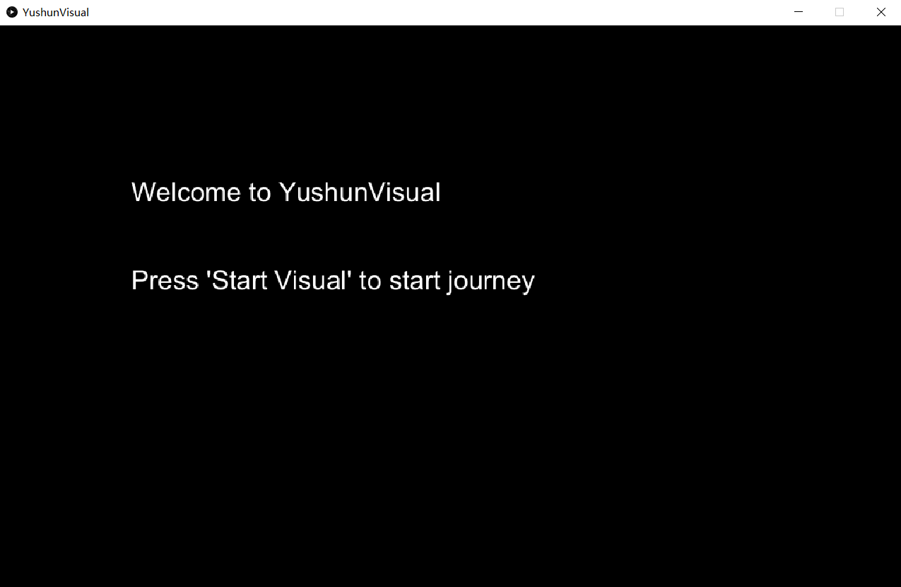

# Music Visualiser Project

Name: Yushun Zeng

Student Number: D18130495

# Description of the assignment
Wellcome to YushunVisual! In this assignment You will experience four different visual effects. There is a controller that can help you easily switch between each visual.

The first music use for visual 1 - 3.

[](java/data/music.mp3)

The second music use for visual 4.

[](java/data/music1.mp3)

1. First visual: In this visual, there are two big circles represent two different channels, inner circle for left channel and outer for right channel.
				 Also, there are some polygons as background and they can shake, the width of the edges of each polygon can become more width depend on the amplitude of the audio.

2. Second visual: In this visual, there is a big circle in the center of the screen, and this circle is constructed by many sticks, under the sticks will have many 					  circle that has been synchronized to the music, it can become bigger and have different color.
				  At top and bottom will have some sticks to make this visual more beautiful and also synchronized to the music.

3. Third visual: In this visual, many circles are generated from the center of the four sides of the screen, and diverge to the middle of the screen.
				 This circles have different size and color, both of this has been synchronized to the music.

4. Fourth visual: This is the most amazing visual in this assignment.
				  In this visual, you can see how the thousand of pixels form a picture. This visual has been appropriately synchronized to the music, the number of pixels drawn per second is related to the amplitude of the audio.
				  In this visual I decided to use an instrumental music which can make it more enjoyable.

# Instructions
When you run this program, it will generate two black screens, one for controller and another is to show the visual.
- This is what the controller looks like, and there are 5 buttons on it, press first button to start the visual and press again for pause.


- This is the start screen to show the visual.

1. Press start buttons to start the visual, it will automatically jump to the first visual(The first visual botton "Two-channel dance" will light up).

2. Press the thrid button switch to the second visual "Rain".

3. Press the fourth button switch to the third visual "Pop-out".

4. Press the fifth button switch to the fourth visual "Draw", there is a special music use for this visual, and should go to java\src\D18130495 modify YushunVisual.java loadAudio("music1.mp3");, this visual is especially synchronized with the music.
- The start of this visual will looks like:

- The end of the visual will looks like:

- The original image of this visual:

# How it works
First of all, I have to say thanks to last year students' assignment which inspire me about the controller idea!
## Controller
1. At the start of this assignment, I created two classes, one is YushunVisual.java, this is the subclass of ie\tudublin\Visual.java which mean I extends Visual.java. This is used as main class of this project, it will call the other class and show the different visuals. The second class I created is Control.java, which is used to switch each visual.
2. The main difficulty of this part is how to link each class today and make the controller work. The main idea is in the ie\tudublin\Main.java new Controller object and use this Controller object to new YushunVisual object. The usage of (this.) is the key to connect each object together.
- In the Main.java call Controller
```Java
	Control control = new Control();

	public static void main(String[] args)
	{
		Main main = new Main();
		main.control();
		main.control.startUI();
	}
```
- In the Control.java call YushunVisual
```Java
	YushunVisual visual = new YushunVisual();

	public void startUI()
	{
		String[] a = {"MAIN"};
        processing.core.PApplet.runSketch(a, this.visual);		
	}
```
## First visual: Two-channel dance
1. This visual have two elements in it. The first element is two big circles, inner circle synchronized to the left channel of the music and outer circle is synchronized to the right channel of the music. The second element is the multiple polygons as the background, all the polygons can shake and the width of each polygon are synchronized to the music.
2. In this visual, I used lots of sin and cos to make circle and find position of vertex to make polygons. For the two circles simply use sin to find the position of startX and endX, use cos to find startY and endY. For the second background polygons, it has same concept to find the position of polygon, but this time is to find the vertex of it, and use beginShape() endShape(CLOSE) to link each vertex to shape a polygon.
3. The implementation of this visual have two difficulties which make me think a lot.
- The main difficulty of the first element is how to fill the color and make it looks beautiful. If I just fill this circle with rainbow color, the start color is red and end color is blue, this two color will link together and looks uncomfortable.

So, I try two combine two rainbow color together, make two rainbows red color link together and blue color link together.
Start with red and end with blue(left) range(3pi / 2 - pi / 2), start with red and end with blue(right) range(- pi / 2, pi / 2).

To achieve this effect I use sin and pi.
```Java
255 - yv.sin(yv.map(i, 0, yv.getAudioPlayer().left.size(), 0, 1) * yv.PI) * 200, 0, yv.sin(yv.map(i, 0, yv.getAudioPlayer().left.size(), 0, 1) * yv.PI) * 200);
```
First use map function, beacse i is always growing, so the value after map is also growing, the R(red) value is continuous decline and B(blue) value is increase, after achieve map value is greater than 0.5, the R(red) value is increase and B(blue) value is decline, so this can fill the circle appropriately.

- For the second elements, how to make the polygons shake is the most difficult part.
```Java
int change = 0;

for (int d = 0; d < num; d++) {
	float radian = yv.cos(yv.radians(change / 100 + 20 * d));
	float r = radius + yv.map(radian, -1, 1, -changeRange, changeRange);
	yv.vertex(x + yv.cos(yv.radians(d * 360 / num)) * r * 1.1f, y + yv.sin(yv.radians(d * 360 / num)) * r * 1.1f);
}

change += 4;
```
The most important part is change and radian variable, by continuous increase the value of change will generate different length of line.
Adding the change variable to radian will generate different length of radius, and this will move the vertex position, so the polygon can move.

## Second visual: Rain
1. This part have three elements on it, a circle that use sticks formed, small circles can change size depend on the music, and some line on the top and bottom to make visual more Beautiful.
2. Use sin and cos make sticks form a circle and same idea to make small circle under the sticks.
3. There are not have too much difficulties to achieve in this part. It just requires a lot of calculations and running tests.
## Third visual: Pop-out
1. In this part, lots of colorful small circles will be formed at the center of the edges from four sides, and move to the center of the screen.
2. I created circle.java to generate circles, and update function to make circle to move. In the Popout.java I created four arraylist for four different directions, and each arraylist store the circles and can call them own update function.
3. The main idea for this part is the usage of object. Create each object and call the function they have.
## Fourth visual: Draw
1. In this visual, lots of small pixel objects will be created finally form an image.
2. This is the most excited part I made in this assignment, it use lots of processing method and OOP concept.
- Firstly, I use PImage data type to load image in to YushunVisual.java. After this I parsing the image, there are 1024 X 640(the size of the screen) pixels on the screen, use two loops to traverse each piexl and use brightness() function to determine which pixels have to be store in the pixel arraylist. (brightness() will return the highest value color of (R, G, B))
```Java
PImage image = loadImage("1.png"); //load image
        for(int x = 0; x < image.width; x++)
        {
            for(int y = 0; y < image.height; y++)
            {
                int index = x + y * image.width; //find the index of current pixel
                float  b = brightness(image.pixels[index]); //brightness() will return the greatest value of (R, G, B)
                if(b == 255) {
                    pixel.add(new PVector(x, y)); //store in the PVector arraylist
                }
            }
        }
```
- Secondly, I created rect.java, this is use to create pixel object. After Draw.java is called, randow pixel will be pickes in the pixel arraylist and add to the rect arraylist. After add to the rect arraylist, the pixel will be removed from pixel arraylist, this is for avoid repeatedly add same pixel to rect arraylist.
- Thirdly, rect object will be created according to the rect arraylist and draw on the screen, rect will be created depend on the size of rect arraylist and music amplitude. Because there are thousand of pixels shoule be drawn on the screen, so I gradually increase the generation speed of pixel.
3. In this part, I spend the most time on music synchronization and running tests, I also chose a special music for better showing music synchronization and better looking experice.
# What I am most proud of in the assignment
- In this assignment, I did lots of seif-study and brainstorm lots of ideas.

| For which visual | What I learned |
|-----------|-----------|
|visual 1 | vertex(), beginShape(), endShape(), usage of sin and cos, usage of different channels |
|visual 3 | practice concept of object oriented |
|visual 4 | Pimage class, PVector class, brigthness() |

1. The visual 4 in this assignment is my most proud of. Whether idea and implementation, both made me really excited after achieve the result.
- In this part, I taught myself new coding skill with processing:
How to load image, use brightness to identify the black and white and how to use PVector arraylist to store the vertex:
```Java
PImage image = loadImage("1.png");
        for(int x = 0; x < image.width; x++)
        {
            for(int y = 0; y < image.height; y++)
            {
                int index = x + y * image.width;
                float  b = brightness(image.pixels[index]);
                if(b == 255) {
                    pixel.add(new PVector(x, y));
                }
            }
        }
```
- Except the coding skill, I also practice concept of OOP in this part, use rect.java class to new object and draw them on the screen.
- The visual feeling of the final product is also made me very proud.
2. I am also proud of the usage of sin and cos to make different circle and colors.
- In the visual 1, use sin and pi to generate two symmetrical color rainbows which I mentioned in the "How it works: First visual: Two-channel dance", this took me a long time to think, searched resources, and did calculations.
- How to make the background polygon shake is also took me long time to think. After draw some graph and analysis, I find the solution of it which I mentioned in the "How it works: First visual: Two-channel dance", both of the difficulties are caused by how to draw and change the shape of circle, and how to use sin and cos to solve the problem.
3. The last thing that makes me proud is connected Main.java, YushunVisual.java and Control.java together.
- This help me better understand how the object worked in different class.
# Youtube video
## Visual 1 - 3(recommended to wear headphones)
[](https://youtu.be/_THaqqJAlP0)
## visual 4(recommended to wear headphones)
[](https://youtu.be/Z1OZTRxAJQs)


